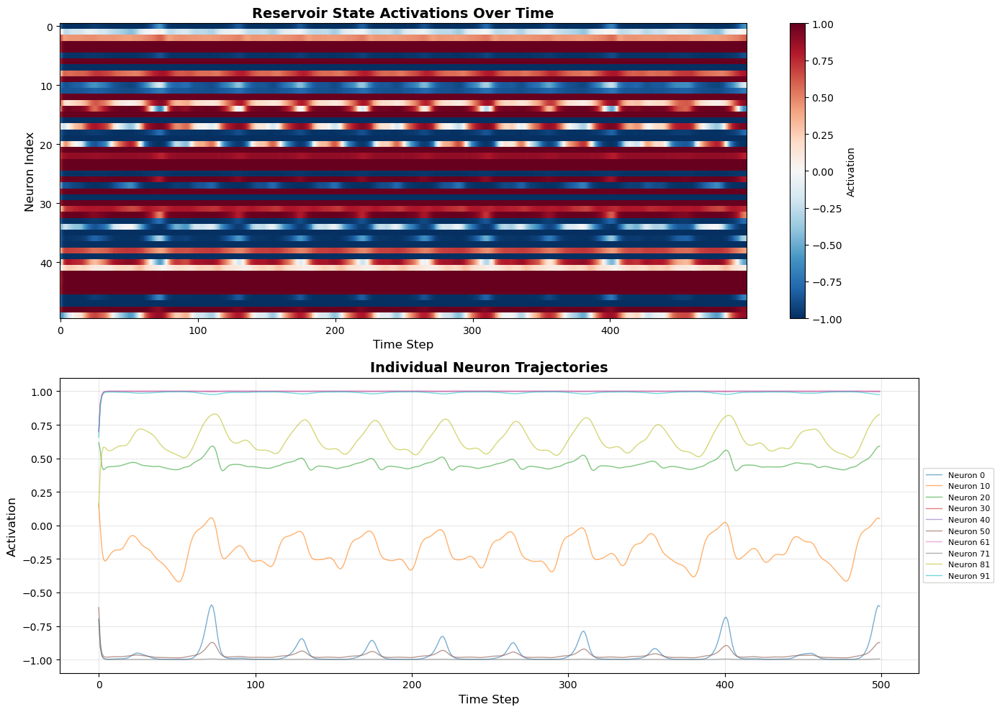
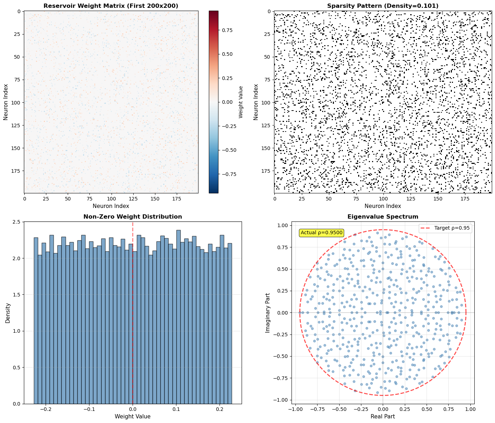

# Echo State Networks

## Project Overview

Echo State Networks (ESNs) are a type of recurrent neural network that operate by fixing the reservoir weights and only learning a linear readout layer via ridge regression. 
This approach significantly improves the computational efficiency by removing backpropagation through time while maintaining the temporal modeling capabilities of RNNs through the echo state property. 
ESNs excel at chaotic time series prediction, real-time signal processing, temporal pattern recognition, and more by capturing the dynamics within the states of the reservoir.

## What are Echo State Networks?

An ESN consists of three layers: an input layer that projects input signals into the network, a reservoir (hidden layer) of sparsely and randomly connected recurrent neurons with fixed weights, and a readout layer that linearly combines reservoir states to produce outputs. 
The key principle is the echo state property: if properly configured, the reservoir state becomes a nonlinear function of the input history, effectively providing both temporal memory and nonlinear expansion of the input signal. 
Training then amounts to solving a linear regression problem for the readout weights, making ESNs computationally efficient while modeling complex dynamical systems.

## Architecture

The ESN model is defined by three equations implementing discrete time leaky integration dynamics:

$$\tilde{x}(n) = \tanh(W^{\text{in}}[1; u(n)] + Wx(n-1))$$

This equation computes the pre-activation reservoir state by combining the current input and previous reservoir state through the weight matrices.

$$x(n) = (1-\alpha)x(n-1) + \alpha\tilde{x}(n)$$

This leaky integration equation creates a weighted average between the previous state and the new activation, implementing a low-pass filter that controls how quickly the reservoir responds to changes. 

$$y(n) = W^{\text{out}}[1; u(n); x(n)]$$

The output equation then linearly combines the bias, current input, and reservoir state to produce predictions. 
Notably this output equation is the only trainable component, which is learned via ridge regression to map the rich reservoir dynamics to the output.

Here $u(n)$ is the input, $x(n)$ is the reservoir state, and $y(n)$ is the output at time $n$. 
The input weights and reservoir weights are randomly initialized and remain fixed, while output weights are trained. 
The leaking rate $\alpha$ controls the speed of reservoir dynamics. Smaller values create slower, more integrative dynamics. 
The reservoir matrix is then scaled to have a spectral radius $\rho$ near 1.0 to balance memory and stability over the time horizon. 
The reservoir are defined as being sparse, 1-20% density, with weights drawn from a uniform distribution then scaled for the spectral radius.

## Training Process

To train the ESN we follow these steps:

1. Generate a random sparse reservoir with desired spectral radius and sparsity
2. Run the reservoir with training input and collect reservoir states 
3. Discard the initial washout period to eliminate transient effects
4. Solve for the optimal output weights using ridge regression
5. Use the trained network to predict new inputs

## Experimental Settings

This implementation evaluates ESNs on the Mackey-Glass chaotic time series prediction task. 
The Mackey-Glass system is defined by the differential equation $dy/dt = 0.2y(t-17)/(1+y(t-17)^{10}) - 0.1y(t)$, which generates chaotic system dynamics. 
We discretize this system with step size $\delta=0.1$ and subsample by 10 to create training and test sequences. 
We define the task to be predicting a single step in the future $y(n+1)$ given the current value $y(n)$, and evaluate it using normalized root mean square error (NRMSE). 
Our reservoir configuration uses $N_x=550$ neurons with density $\approx 0.17$, spectral radius $\rho=0.92$, input scaling $3.2$, leak rate $\alpha=0.79$, and regularization $\lambda=0.19$, trained on 12,000 timesteps, after a 250 step washout, and tested on 3,400 timesteps.

## Hyperparameter Optimization

In this work we automate the hyperparameter sweep searching over 1000 trials using random sampling from a search space. 
Each configuration was evaluated by averaging NRMSE over 3 independent runs with different random seeds.
We find the following hyperparatmeter settings for the range, top 10%, and best value

| Parameter | Search Range | Top 10% Range | Best Value |
|-----------|--------------|---------------|------------|
| Reservoir Size ($N_x$) | [100, 1000] | [300, 800] | 413 |
| Spectral Radius ($\rho$) | [0.5, 1.05] | [0.70, 1.04] | 0.9274 |
| Density | [0.01, 0.5] | [0.01, 0.30] | 0.2091 |
| Input Scaling | [0.01, 5.0] | [1.23, 4.92] | 3.5479 |
| Leak Rate ($\alpha$) | [0.01, 0.99] | [0.51, 0.98] | 0.8789 |
| Regularization ($\lambda$) | [0.00001, 0.5] | [0.05, 0.30] | 0.1260 |
| Washout | [50, 750] | [50, 494] | 397 |
| Train Length | [2000, 25000] | [5307, 19823] | 10727 |
| Test Length | [2000, 7500] | [1176, 4974] | 3450 |

The single best configuration achieved, resulting in NRMSE = 0.027935, demonstrates excellent performance.

## Results

Our ESN implementation demonstrates strong performance on the Mackey-Glass chaotic prediction data. 
The visualizations below illustrate this success in a range of validation tasks.
It further reveals that our ESN implementation is working appropriately through a visualization of the internal mechanisms.


*Figure 1: ESN predictions perfectly track the Mackey-Glass target signal.*

The predictions exactly track the target with minimal deviation, demonstrating that the reservoir's high dimensional state trajectory successfully encodes the system's chaotic attractor structure. 
Further, the near perfect temporal alignment in sequencing confirms that the linear readout from the learned reservoir features are sufficient in reconstructing the complex nonlinear dynamics.



*Figure 2: Reservoir dynamics show the activation heatmap and individual neuron trajectories.*

Heterogeneous activation patterns demonstrates some form of specialization emerging from random connectivity. 
The neurons develop specialized patterns at multiple timescales which collectively, span a rich feature space. 
The diverse nature of the neuron oscillations are what enables the linear separability of the target signal from reservoir states, or rather the diverse patterns are visualizations of these underlying dynamics.


*Figure 3: Reservoir analysis: sparse weight matrix (top left), sparsity pattern (top right), weight distribution (bottom left), and eigenvalue spectrum (bottom right)*

The eigenvalue spectrum, the bottom right, confirms that $\rho_{\text{actual}} = 0.95 < 1$, which satisfies the necessity for ESP. 
Combined with the sparsity, shown from the top right graph, sitting around $10\%$, and the uniformly distributed weights from the bottom left graph, the we show the ESN is work as intended. 
This ESN implementation is thus a contractive high dimensional nonlinear mapping that preserves input dynamics in a temporal structure.

## Conclusions

This implementation demonstrates that Echo State Networks provide a highly effective and efficient approach to chaotic time series prediction, achieving excellent performance (NRMSE < 0.03) with minimal training time compared to gradient-based RNN methods. 
The success relies on three key factors: (1) proper reservoir initialization with spectral radius near 1 and appropriate sparsity, (2) leaky integration to match signal timescales, and (3) ridge regularization to prevent readout overfitting. 
The visualization of reservoir states reveals that ESNs succeed by creating a diverse population of dynamic filters that collectively provide both memory and nonlinear transformation of input signals. 
While hyperparameter optimization improves performance, the method is remarkably robust—good results are achievable across wide parameter ranges, making ESNs practical for real-world applications where computational efficiency and rapid prototyping are essential.


## Citation

If you use my code in your research, please cite me:

```bibtex
@software{pjm2025ESN,
  author = {Paul J Mello},
  title = {Echo State Networks},
  url = {https://github.com/pauljmello/Echo-State-Networks},
  year = {2025},
}
```


## References

Jaeger, H. (2001). The "echo state" approach to analysing and training recurrent neural networks. *GMD Report 148*.

Lukoševičius, M. (2012). A practical guide to applying echo state networks. In *Neural Networks: Tricks of the Trade* (pp. 659-686). Springer.

